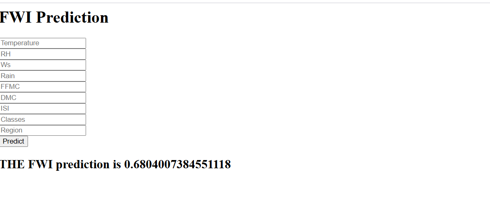

# 🔥 FWI Prediction Web App

This project is a Flask-based web application that predicts the **Fire Weather Index (FWI)** using meteorological input features such as temperature, humidity, wind speed, and more. It uses a machine learning model trained on historical fire weather data to estimate FWI, which helps in assessing fire danger.

---

## 🚀 Features

- Simple and intuitive HTML form to input weather data
- Flask backend to handle requests and make predictions
- Pre-trained ML model (`lasso.pkl`) with a feature scaler (`scaler.pkl`)
- Real-time prediction displayed on the same page

---

## 📁 Project Structure

```
FWI-Prediction/
│
├── application.py        # Main Flask app
├── templates/
│   └── home.html         # Frontend HTML page
├── lasso.pkl             # Trained ML model (Lasso Regression)
├── scaler.pkl            # Scaler for preprocessing input features
├── README.md             # Project documentation
```

---

## 🧠 Model Info

- **Algorithm**: Lasso Regression
- **Trained On**: Cleaned and preprocessed weather dataset
- **Input Features**:
  - Temperature
  - RH (Relative Humidity)
  - Ws (Wind Speed)
  - Rain
  - FFMC (Fine Fuel Moisture Code)
  - DMC (Duff Moisture Code)
  - ISI (Initial Spread Index)
  - Classes
  - Region

---

## 💻 How to Run

1. Clone the repository or download the code files.
2. Make sure you have Python 3 and Flask installed:
   ```bash
   pip install flask
   ```
3. Run the Flask application:
   ```bash
   python application.py
   ```
4. Open your browser and go to: [http://127.0.0.1:5000](http://127.0.0.1:5000)
5. Fill in the form and get your FWI prediction.

---

## ⚙️ Requirements

- Flask
- Scikit-learn (for model loading)
- NumPy
- Pickle (standard Python module)

---

## 📸 Screenshot



---

## 📌 Note

- Make sure `lasso.pkl` and `scaler.pkl` are in the same directory as `application.py`
- Ensure all field names in the HTML match the ones expected by the backend

---

## 📬 Contact

For any feedback or suggestions, feel free to reach out!
